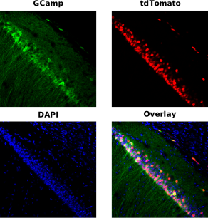

# Project Miniscope_2s notes

## Summary

The miniscope_2s desgin, with two filter set configurations: GFP+mCherry and GFP+tdTomato, has been validated *in vivo* with following animals:

* WT - GCamp_tdTomato_conjugated.
  This is the most promising animal setup.
  Confocal imaging has shown a near 100% overlap between the GCamp channel and the tdTomato channel.
  *in vivo* imaging show good signals in both channel and a fair amount of overlap.
  However, during *in vivo* imaging, there are still cells showing GCamp signal but not tdTomato signal, suggesting an imperfect alignment of focal plane.
  See [the data section](#data-gcamp_tdtomato_conjugated) for detail.

* WT - fosTTA-mCherry and syn-GCamp
  This animal setup has a cocktail of 3 virus.
  Initially during baseplatting, there were no signal in the red channel.
  We then decided to take the animals off-dox for a few month.
  After that we did some *in vivo* imaging.
  Both channels had clear signals.
  However the cell shape in red channels look weird, and the overlap was not good.
  See [the data section](#data-fostta-mcherry-and-syn-gcamp) for detail.

* WT - mCherry and syn-GCamp
  This is a 2 cocktail setup.
  During baseplating, we see clear signal in the red channel.
  However the cell shape in the red channels look weird.
  At the same time, we see no fluctuation in the green channel at all.
  We think that the mCherry virus might killed all the cells.
  We decided to not baseplate these animals.

## Data: GCamp_tdTomato_conjugated

All mice were wild type and injected with `AAV1-hSyn-GCaMP6f-P2A-nls-dTomato` virus at stock concentration.

### m00

#### *in vivo* Imaging

<embed type="text/html" src="../output/tdTomato/overlap/m00.html" width="1200" height="900"></embed>

#### Confocal

{width="900px"}

## Data: fosTTA-mCherry and syn-GCamp

All mice were wild type and injected with a cocktail of 3 virus: `AAV9-FosTTA`, `AAV9-TRE-mCherry`, `AAV1-syn-GCaMP6f`.
Initially there were no signal in the red channel.
We then take the animals off-dox for a few month and we have the following *in vivo* imaging.

### m03

#### *in vivo* Imaging

<embed type="text/html" src="../output/mCherry/overlap/m03.html" width="1200" height="900"></embed>

### m04

#### *in vivo* Imaging

<embed type="text/html" src="../output/mCherry/overlap/m04.html" width="1200" height="900"></embed>